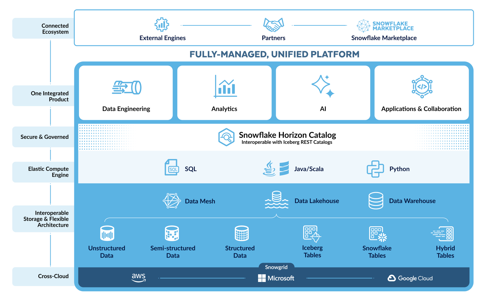

Before going hands-on, a basic understanding about the Snowflake architecture is useful, as well as an overview of some of the features. There is a lot so this will not be complete.

https://www.snowflake.com/en/product/platform/

