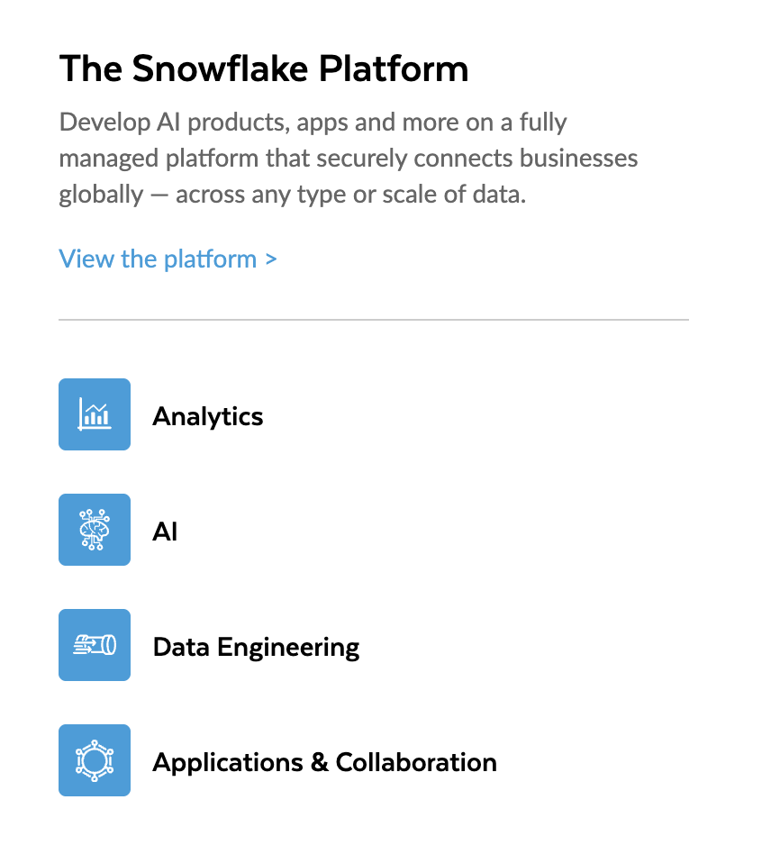

Before going hands-on, a basic understanding about the Snowflake architecture is useful, as well as an overview of some of the features. There is a lot so this will not be complete.

## Just a database

When I started working with Snowflake back in 2019, it was an upcoming force. Via one of my old contacts, who was a presales at Snowflake at that moment, I landed a freelance gig at energy grid operator Enexis. We can truely say that, at that moment, Snowflake was 'just a database'. Enexis started a big migration from Oracle/BODS to Snowflake/Matillion. At my intake, the fact that I just followed nothing more than a training from the 'Hands On Essentials' was enough. I was able to 'learn on the job' for which I am still grateful. 

Over the past 6 years, a lot of exciting stuff happened with Snowflake.

## From 'just a database' to 'The AI Data Cloud'

The major change: the 'AI Data Cloud'. A couple of years ago, I did a presentation somewhere on Snowflake, those guys were primarily interested the data-lake options (they were Databricks guys :)). At that time, Snowflake did support external tables.  

# Comparing Snowflake with Databricks/Fabric

You will not find that here. I only focus on Snowflake. Go to Linkedin and follow https://www.linkedin.com/in/josuebogran/ and https://www.linkedin.com/in/nick-akincilar-3417945/